## Vice Cracker
### From Team: The Mildly Sharp Coders: Ellen, Paul, Elyria, Rika :pizza::beers:

## App Usage
Do you have very bad habits? DO you find yourself binging on Beer, Ice Cream, and Soda? Sounds like you need some help with managing your vives. Use our app to track your daily/monthly consumption of your vices. You will be able to take what your consumptions and alerted if you go over your max consumption level. Alerts will help you stay motivated with information for local health stores, gyms, healthy recipes and work out videos! We help you improve yourself one day at a time.

## Technologies Used
- Reminder
- Moment.js
- Node
- Axios
- Unirest
- Youtube API
- Yelp API
- Spoonacular API
- Twilio API
- Express
- Mongo DB
- Material-kit-react
- Bcrypt
- Passport

## How it Works
Our Application is ideal for mobile usage. :iphone::iphone:

Please log in or create an account

Complete all fields for your user account. Make sure you are using a valid email, phone number, and address.

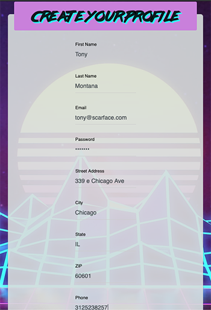

After creating your account you will be redirect to the create Vices page. If you are confused on what you need to do, there is a handy button for you to press to learn more about navigating the app. 

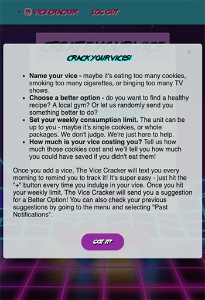

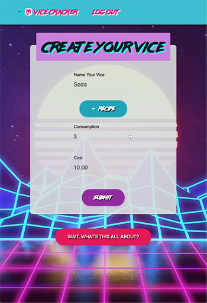

You can select your "better options" from a drop down list. If you are not sure which one you want, select random! Enter your max consumption and how much you spend per purchase.

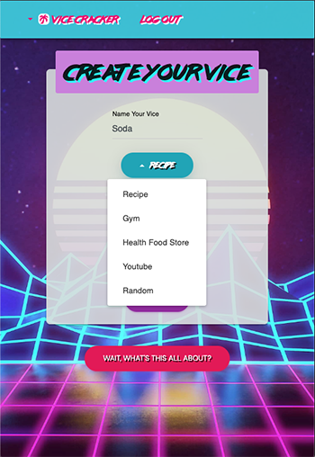

After you create your vice, you will be redirected to the vice page where you can see a list of all your vices so that you can track your consumption by pressing the "+" button. You can delete a vice if needed as well. 

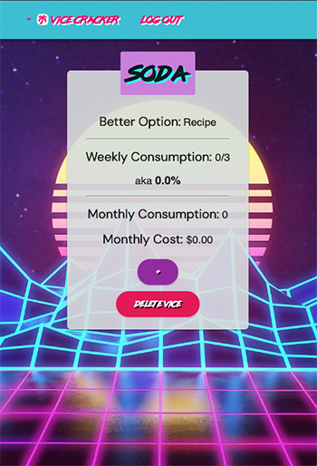

Need to add another vice or nagivate to another page? Use the drop down menu on the top left. 

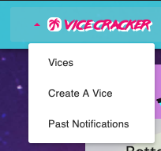

You can add multiple vices. Scroll through them and press the "plus" button each time you consume the vice. 

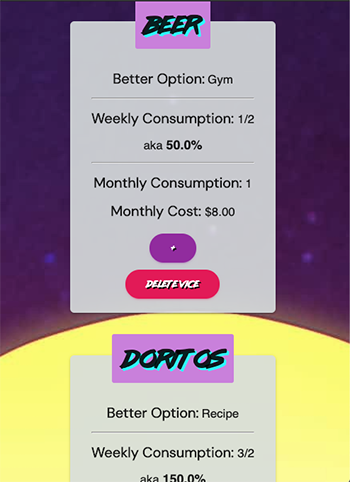

You will receive notifications on your phone if you go over your consumption limit. The notifications will send you a link from the caterogy your selected as your "better option".

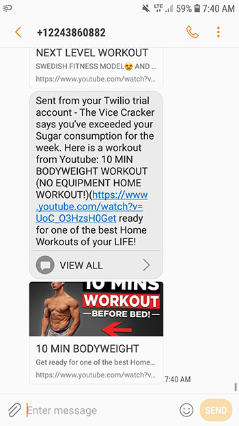

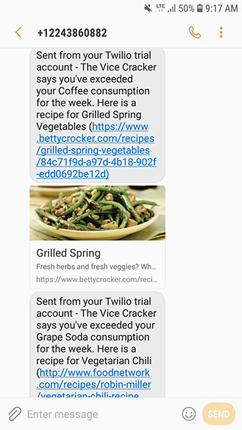

Need to locate your past notifications? They are also stored in the app for future viewing. 

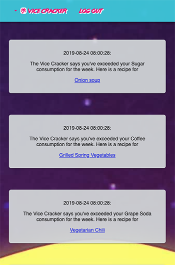

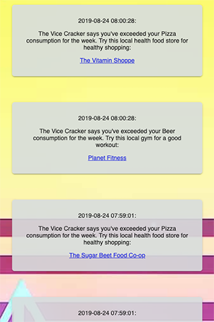

## The Future
- Able to modify your vices if consumption levels need to be updated
- Payment processing 
  - For extra assistance
  - Fee for not committing to your consumption limits
  
- Rewards and Badges for meeting your goals!
- Push Notifications to your phone
- Update user account information for change of address, email, and phone number. 

:exclamation: You have reached the end. Thank you from Team The Mildly Sharp Coders. :tada:

Visit our heroku page to use our app
<https://vice-cracker.herokuapp.com/>
