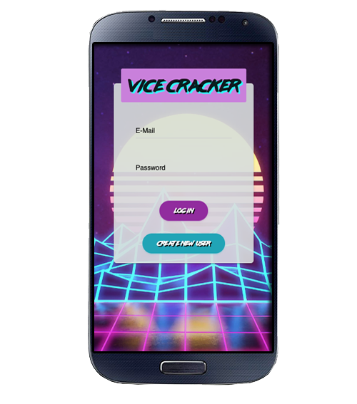

## Vice Cracker
### From Team: Mildy Sharp Coders: Ellen, Paul, Elyria, Rika

## App Usage
Do you have very bad habits? DO you find yourself binging on Beer, Ice Cream, and Soda? Sounds like you need some help with managing your vives. Use our app to track your daily/monthly consumption of your vices. You will be able to take what your consumptions and alerted if you go over your max consumption level. Alerts will help you stay motivated with information for local health stores, gyms, healthy recipes and work out videos! We help you improve yourself one day at a time.

## Technologies Used
- moment.js
- node
- axios
- unirest
- Youtube API
- Yelp API
- Spoonacular API
- Twilio API
- Express
- Mongo DB
- Material-kit-react

## How it Works
Our Application is ideal for mobile usage. 

Please log in or create an account

## The Future
- Able to modify your vices if consumption levels need to be updated
- Payment processing 
  - For extra assistance
  - Fee for not committing to your consumption limits
  
- Rewards and Pages for meeting your goals!
- Push Notifications to your phone

:exclamation: You have reached the end. Thank you from Team Mildy Sharp Coders. :tada:
